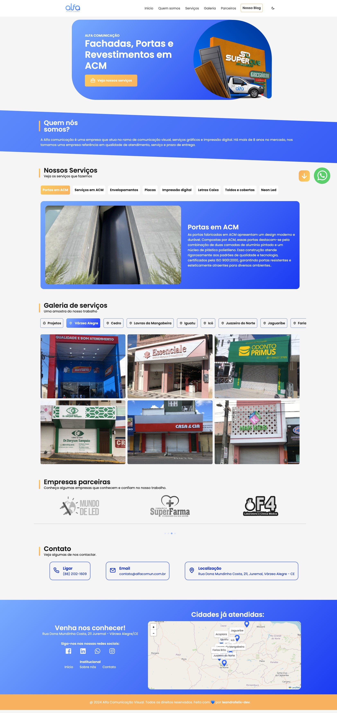

# Alfa Comunicação - Landing Page 🚀

Este repositório contém o código da landing page da **[Alfa Comunicação](https://alfacomun.com.br/)**, uma empresa especializada em serviços de comunicação digital. O projeto é **proprietário** e não está disponível para uso público ou contribuições externas.

## Funcionalidades ✨

- 📱 **Design responsivo**: Adaptável a dispositivos móveis e desktops.
- 💼 **Apresentação de serviços**: Destaque para os diferenciais da empresa.
- 🔍 **SEO otimizado**: Melhor desempenho nos motores de busca.

## Tecnologias Utilizadas 🛠️

- **HTML5** e **CSS3**: Estruturação e estilização da página.
- **JavaScript**: Para interatividade e funcionalidade da página.

## Preview 🖼️

Aqui está um exemplo da tela final da landing page:

## Licença ⚖️
Este projeto é de propriedade da **Alfa Comunicação** e não está disponível para distribuição, modificação ou uso público.
